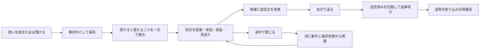
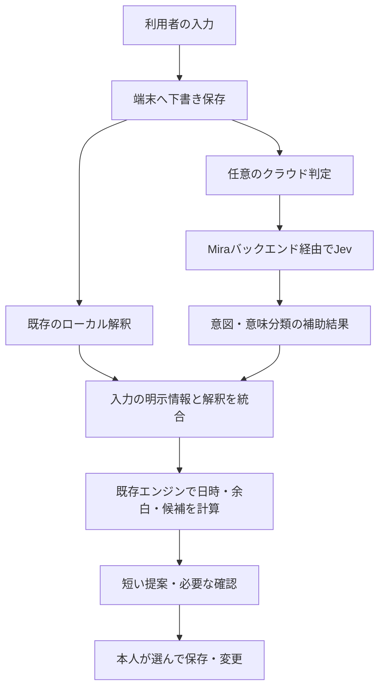

# Miraの機能・UX検討メモ

2026-09-21。要求仕様、現行Swiftコード、Jevの公式資料を照合した検討案。既存の要求仕様を変更する決定文書ではない。実装済みはコード上で確認できた範囲を指し、この調査ではiPhone実機・Simulatorでの動作検証は行っていない。

**中心提案は、Miraを「自分の余力を守りながら、誘いへの判断と返事を進められる秘書」として磨くこと。**

余白の配置・保護・日程調整にはすでに多くの実装がある。優先したいのは、実生活の予定との接続、途中状態の保存、次に自分がすることの明確化である。Jevは自然な日本語をこれらの機能につなぐ補助として有望だが、日本語での効果はこれから検証する。

**Miraが引き受ける仕事**

要求仕様の目的は「自分が送りたい生活を先に確保したうえで、人との予定も気持ちよく入れられるカレンダー」。予定がない時間を、本人が使ってよい余力として評価する。

利用者がMiraに任せたいことは、次の流れに整理できる。

1. 誘いや思いつきを、忘れる前に預ける。
2. 受けた場合に失う時間と、残せる時間を把握する。
3. 参加・別日提案・保留・見送りから一つ選ぶ。
4. 返事と日程確定まで進める。
5. 中断したら、決めかけたところから戻る。

休息も趣味も大切な人との時間も本人の希望である。目標を下げることや、今回は誘いを優先することも選べる。何日もアプリを開かなかった後に、使い直せることを重視する。

根拠：[要求仕様](requirements-specification.md) PR-001〜008、[プロダクト概要](product-spec.md)。

**現状の実装と、改善する方向**

| 領域 | 現状 | UXを良くする方法 |
|---|---|---|
| 月・日カレンダー | 月グリッド、日別画面、予定追加・移動・削除がある | 月表示を維持し、近い予定・直近の余白・自分の返事が必要な一件を短く見せる |
| 余白目標 | 休息・読書・個人プロジェクト・大切な時間等の目標と進捗、未来月への引継ぎがある | 月の不足数だけでなく「次に確保できている休息」を示す。目標と現在の配置を分けて見せる |
| 余白配置・再設計 | 自動配置、負荷に応じた目標提案、再配置案の保存・適用がある | 変更前後の差分、本人が固定した枠、配置できなかった理由を一枚に。現在時刻より前へ新規配置しない |
| 予定入力の秘書 | 入力中の重複、余白消費、目標への影響、別日提案がある | 最初は「何が変わるか」一文＋おすすめの行動一つ。理由と他案は展開する |
| 最後の余白の保護 | 新規予定・誘いには余白移動、例外追加の明示選択がある。調整候補の確定経路には不足がある | すべての確定経路で影響確認を揃える。「OK」より結果の分かるボタンにする。例外も戻せるようにする |
| 負荷・バッファ | タイトル・日時・意味分類から負荷と準備・移動・回復時間を推定。負荷クラスの明示訂正がある | バッファの見積もりも修正可能にする。負荷訂正とバッファの整合を保つ |
| 検討中の誘い | 日付未定の保存、参加・日程調整・見送り・アーカイブがある | 保管後に「いつ戻るか」「次に何を決めるか」を任意で残す |
| 日程調整 | 候補推薦、仮押さえ、重複警告、共有文、一件確定時の他候補解放がある | 「候補作成」「自分が送る番」「相手の返事待ち」「自分が返す番」を分ける |
| 会話入力 | 自然文での登録・相談・変更・日程探し、文脈指定、会話履歴、断り文がある | 履歴を読み返さなくても、途中の入力・選択・未確定点を復元する |
| ローカルAI | Foundation Models対応時の分類・解釈・断り文生成、ルール／テンプレートの代替がある | 通信やAIの有無にかかわらず預けられる。推定した箇所だけ簡単に直せる |
| 通知 | 一部の調整作成経路に締切前日の通知がある | 会話から作る調整、検討中の誘いにもつなぐ。通知から対象案件と次の操作へ直行する |
| スキン・大切な人 | Soft Minimal／Pixel Cat、人物の登録、人物別目標の保存がある | 猫の表現量・動き・通知口調を選べる。人物別目標は予定との紐付けと集計が必要 |
| 保存 | SwiftDataで予定・目標・案件・会話等を端末に保存する | 保存失敗を隠さず再試行できる。編集中のフォームや候補選択も保存対象にする |
| 外部カレンダー・移行 | EventKitによる祝日参照はある。通常予定の同期は未接続。旧カレンダー移行はモック | 実際の予定を読み、重複登録や同期失敗を扱えるようにする。OCRはその後に接続する |

会話や再設計などはREADME・implementation-statusの一覧だけでは把握しきれないため、現行コードを優先した。実際のタブ／シート制御は、project.ymlが採用する `MiraOverrides/MainTabCoordinator.swift` で確認した。

**先に直す価値が高い、具体的なつまずき**

| 優先 | 確認できた状態 | 改善案・完了条件 |
|---|---|---|
| 最優先 | デモ設定が既定で有効。SystemClockへの分岐はあるが、通常利用へ切り替える設定UIが見当たらない | 日常利用とデモ体験を分離。初回の実データ利用で現在日時と本人の予定を扱う |
| 最優先 | 永続ストア初期化失敗時に、無警告でメモリ保存へ切り替える | 保存できていないことを表示し、再試行・回復を用意。「保存済み」の誤認を防ぐ |
| 最優先 | シートを閉じると調整下書き・変更プレビュー等をnilにする | 閉じる＝中断として永続化。再起動後も同じ案件・入力・候補から続けられる |
| 最優先 | 候補保存時点で調整が `.waiting` になる。共有は後の操作 | 未送信と返事待ちを分離。「コピーした」「共有画面を開いた」だけでは送信済みと扱わない |
| 最優先 | 調整候補の確定では余白への影響を計算後、常に例外扱いで保存する。確認文は日程確定と他候補の解放に限られる | 新規予定と同じ影響確認を通し、最後の余白の移動・例外を本人が選べるようにする |
| 高 | 「今月の目標を見直す」が案内toastを出して入力画面を閉じる | 対象月の目標編集へ直接進み、戻ると元の予定入力と再評価結果を復元する |
| 高 | マイ余白の「余白を追加」が予定モードで開く | 余白モードで開き、入口と画面を一致させる |
| 高 | 設定は余白不足通知も案内するが、実装は一部の調整期限通知に限られる | 案内と実装を揃え、すべての主要作成経路で通知状態を更新する |
| 高 | 月間余白配置のエンジンが現在時刻を受け取らない | 月途中では未来の枠だけを新規提案。過去の空白を新たに確保した余白として数えない |

主な根拠：`MiraApp.swift:40`、`MiraStore.swift:136`、`PersistenceModels.swift:26`、`MainTabCoordinator.swift`のsheet制御、`MiraStore+Conversation.swift:330`、`MiraStore+Adjustments.swift:55`、`AdjustmentDetailSheet.swift:46`、`NewItemSheet.swift:92`、`MarginsView.swift:50`、`NotificationService.swift:15`、`SchedulerEngine.swift:134`。行番号は調査時点のもの。

**ADHD気質を前提にした設計仮説**

個人差とその日の状態を前提に、次の困り方を設計・ユーザーテストの対象にする。ADHDという属性から本人の負荷や性格を推測して固定しない。

| 起きうる場面 | Miraの振る舞い |
|---|---|
| 入力項目が多くて、その前に忘れる | 原文一つで保存。「日時不明」のまま置ける。入力の続きも保存する |
| 選択肢が多くて決められない | おすすめ一つ＋他案を二つまで見せる。詳しい比較は求めた時に開く |
| 通知や別アプリへの移動で中断する | 「何を決めたか／何が未定か／次の一手」を案件に残す |
| 予定の時刻だけを見て、準備を見落とす | 開始時刻と一緒に準備開始・出発の目安を示す。見積もりは直せる |
| 数日使わず、未処理の多さで戻りにくくなる | 全件消化を求めず、まだ必要な一件だけ再提示。不要な案件は簡単にしまえる |
| 休息目標まで達成義務に感じる | 「確保できている時間」を伝え、目標変更や保留も普通の選択にする |
| 刺激が多いと疲れる | 通知量・説明量・キャラクター・動きを個別に調整する |

休息をカレンダー上に確保したことと、実際に休めたことは別に扱う。実感を知りたい場合は任意の短い振り返りで聞き、操作履歴から疲労を勝手に学習しない。

記憶に依存しない手順、注意がそれた後の復帰、重要な経路の短縮は、W3Cの[記憶への依存を減らす補足ガイダンス](https://www.w3.org/WAI/WCAG2/supplemental/objectives/o6-memory/)と[集中を支える補足ガイダンス](https://www.w3.org/WAI/WCAG2/supplemental/objectives/o5-user-focus/)を参考にした。これらは認知アクセシビリティの設計指針であり、Miraの効果を検証した研究ではない。

成人ADHDの[展望記憶研究](https://journals.plos.org/plosone/article?id=10.1371/journal.pone.0058338)でも、計画形成と計画の想起・開始・実行では結果が異なる。支援すべき場面を一律に決めず、利用者ごとに確かめる。

**目指す操作体験**

例：「土曜の夜に飲みに誘われた。行きたいけど、今週は疲れてる」

最初のカードは、実際の予定に基づいて、例えば次のようにする。

> 土曜に入れると、今週確保した休息の夜がなくなります。日曜の昼なら残せます。
>
> **日曜の候補を見る**　ほかの方法　あとで決める

「あとで決める」は保存された保留状態になる。再提示時刻は任意で選べる。無期限で保留したものは、通知を繰り返す代わりに、本人が開く静かな一覧に残す。

確定した予定と衝突する場合や最後の余白を消費する場合は、影響を明記して明示操作を求める。本人が直接選んだ内容や例外を、AIの推定で覆さない。

ホームは現在の月カレンダーを維持する。上部の進捗・会話入力・アシスタント表示を整理し、「次の予定」「自分が返事する一件」「直近の余白」を状況に合わせて短く提示する。新しいカードを縦に増やし続けない。通常時の主要操作は一つにし、何もする必要がない時はそのことが分かる表示にする。

オンボーディングは、現在の6ページから段階設定にする。最初は守りたい時間を一つ選び、既存予定を確認できると配置できることを説明し、おすすめ配置を見せる。詳細な曜日、週開始日、スキン、人物別設定は後から整える。カレンダー権限を断った場合も、手入力で体験できる。

**未実装・部分実装を、どの順で育てるか**

| 機能 | 扱い | UXを良くする実装方法 |
|---|---|---|
| 実カレンダー連携 | 日常利用の前提として優先 | 読むカレンダーと書く先を選ぶ。既存予定を確認してから余白を提案。外部変更、取消、繰返し、重複登録を扱い、権限拒否や同期失敗でも入力を失わない |
| 下書き復元・Undo | 最優先 | 原文、フォーム、選択候補、次の必要操作を保存。変更・削除・余白消費を復元可能にする。外部予定は変更後に他端末の編集がないか確認して戻す |
| 案件の行動状態 | 最優先 | 下書き→自分が送る番→返事待ち→自分が返す番→確定／見送り。保留理由と再提示時刻は任意。既存の「検討中」と「調整」はこの状態と対応付ける |
| 共有シートからの捕捉 | 高 | メッセージの文章を渡して即下書き保存。分かる項目だけ埋め、曖昧な箇所だけ後で確認する |
| 通知からの再開 | 高 | 一件の次の行動へ直接入る。時刻変更、保留、完了で再登録・取消。まとめ表示と静かな時間を選べる |
| 準備・出発・回復の表示 | 中。詳細画面のバッファ分数表示は実装済み | 時間軸への可視化、具体的な準備・出発時刻、任意の準備通知、見積もり編集を追加する |
| Widget／App Intents等の入口 | 中 | 「一言預ける」「次の予定」「直近の余白」に絞る。案件状態と本体の保存処理を共用する |
| CloudKit同期・復旧 | 中。複数端末や実ユーザー公開の前に要検討 | ログイン設定を増やさず、同期中・未同期・競合を理解できる表示に。保存成功と同期完了を区別する |
| PDF・画像OCR | カレンダー入出力の後 | 日付・タイトル抽出→重複候補→不確実箇所の確認→登録。誕生日や繰返しは個別に確認できる |
| 人物別の目標 | 必要な人向けの任意機能 | 予定との明示的な人物紐付けと集計を追加。「会っていない人」のランキングや監視へ広げない |
| 生成スキン | 優先度を下げる | 基本の操作・復元・読みやすさを共通化した後で拡張。安心感を増やす範囲に絞る |
| 汎用ToDo、Android/Web、課金 | 別途判断 | 現在は対象外。まず誘いから返事・確定までの一連の体験を完成させる |

ToDoを追加する場合も、最初は予定に付随する準備の一歩程度から検討する。連続利用日数や、利用しないと猫が悲しむ仕組みは、今回の目的に対して優先しない。

**Jevを使うと何が良くなるか**

JevはTypeSafe AIの構造化判断モデル。`Choice`は選択、`Score`は定義された尺度の評価、`Noul`は命題が正しい確率を返す。文章の生成は担当しない。[公式Introduction](https://docs.typesafe.ai/introduction)

Miraでの第一候補は、自然文から適切な操作を選ぶ部分である。

| 入力・用途 | Jevに任せる範囲 | 利用者に返す体験 |
|---|---|---|
| 「金曜飲みに誘われたけど、今週きつい」 | 予定追加／誘いの相談／変更／その他・不明をChoiceで分類 | 検討中のカードを開く。開催が確定した予定として扱わない |
| 「やっぱり来週」「土曜以外なら」 | 言い直し・除外・既存案件への続きかという意味判定 | 対象案件と変わった条件だけ示す。対象が複数なら短く選んでもらう |
| 「家でオンライン映画会」 | 自宅／外出、準備の必要性等の意味分類 | 一般的な外出と同じ負荷を初期設定せず、修正できる推定を出す |
| 「短めで、できれば昼」 | 明示された希望を有限の条件へ分類 | 既存の候補生成・比較ロジックに条件を渡し、理由の分かる候補を示す |
| 提案を表示する直前 | 入力が相談・仮定なのに確定扱いしていないか等の追加チェック | 重要な読み違いを検出した時に短い確認へ戻す。これだけを安全性の保証にしない |

日時の読取りにも使える。公式cookbookは、年月日・曜日・相対表現をChoiceで読み、日付への変換と検証をコードで行う。Miraでもこの分担を保ち、日時比較・重複・期間計算・配置の制約は既存エンジンで処理する。[公式Date extraction](https://docs.typesafe.ai/cookbooks/date_extraction_cookbook)

提案する構成は次のとおり。

実装上は、`ProductionConversationInterpreter`の前後に狭い意図判定サービスを挟む。既存の`ConversationInterpreting`は日時やタイトル等も返すので、JevのChoice結果だけでそのまま置き換えない。`SemanticClassifier`へ接続する場合も、理由文はテンプレート、時間計算はコードで補う。断り文は現在の生成モデル／テンプレートを利用する。

負荷計算、予定可否、通知時刻、候補配置の最終ルールは決定論的なままにする。これにより、現行の「AIは意味分類を補助する」という原則を維持できる。候補の好みをJevに評価させる拡張は、入口の分類で効果を確認した後に検討する。

クラウド利用は任意。APIキーはアプリへ埋め込まず、バックエンドから呼ぶ。当該入力と必要最小限の情報だけを送る。通信が失敗しても保存と手動操作は続けられる。返答待ちの間に利用者が編集した場合、古い判定結果で新しい入力を上書きしない。

**Jevの導入判断に必要な確認**

- 日本語：公式は英語を主学習言語とし、CJKは同等精度ではないと説明している。日本語の省略・否定・言い直しで比較する。
- モデル更新：評価時はバージョンを固定し、更新前後で同じ例文を試す。
- 料金：確認時点の公称は入力100万トークンあたり0.042米ドル、出力無料。Mira全体の運用費には通信・バックエンド等も含まれる。[公式Models](https://docs.typesafe.ai/models)
- 信頼度：confidenceは正答率そのものではない。用途別に誤りを調べて閾値を決め、高信頼度でも本人の明示意思を上書きしない。[公式Confidence](https://docs.typesafe.ai/confidence)
- 正確さ：型が守られることと判断が正しいことは別。公式も数値・日時比較などの弱点を公開している。[公式の既知限界](https://docs.typesafe.ai/model-jaggedness/jev-1.13)
- データ：学習に使わないことと保存しないことは異なる。採用する契約・経路で保存条件を確認し、クラウドに送る範囲を利用者に伝える。[公式Privacy Policy](https://typesafe.ai/legal/privacy-policy)
- 速度：まず日本の端末からの往復時間を測る。公称応答時間をそのままMiraの待ち時間と見なさない。

最初の比較用例文は150〜300件程度を目安にする。これは試作評価の規模案であり、必要精度を保証する件数ではない。架空の入力から始め、否定、仮定、予定変更、対象案件が複数、日付未定、入力途中を含める。評価用例文は調整に使った例文から分離する。

既存の意図判定に対して、正しく開くカード、誤って確定予定の流れへ入る割合、不要な確認、必要な確認の見逃し、修正率、通信時間を比較する。まず画面を変えない評価を行い、改善した用途に限って導入する。AI呼出し回数を増やすこと自体を成果にしない。

**着手順と、良くなったかの見方**

| 順番 | まとまり | 完了を確かめる場面 |
|---|---|---|
| 1 | 既存導線の修復、下書き、案件の状態、Undo | 日程を考えている途中で閉じても同じ所から続けられる。未送信が返事待ちにならない |
| 2 | 実時計・保存の信頼性・実カレンダー接続 | 普段の予定を使い、二重登録や過去への自動配置なしで余白を確保できる |
| 3 | ホーム整理・短い初期設定・捕捉・通知から再開 | 誘いを預け、影響を理解し、返事まで迷わず進められる |
| 並行評価 | Jevによる日本語の意図分類 | 既存処理より修正・確認の負担が減る。オフラインや通信失敗でも操作できる |
| 4 | 準備時間表示、同期、OCR、任意の個別機能 | 利用者が実際に困る場面を確認して、必要な機能から追加する |

評価では、誘いを預けるまでの操作数、影響を本人が説明できるか、中断後の再開成功率、送信し忘れ、意図しない余白消費を記録する。さらに「今週、自分が使いたかった時間を確保できたか」を任意で尋ねる。アプリの滞在時間や連続利用日数を主要な成功指標にしない。

最初のユーザーテストは、困り方の異なる少人数で、通常入力だけでなく「途中で通知が来る」「数日使わず戻る」「ネットが切れる」を含める。ここで見つかった失敗を直してから機能を増やす。

**コード確認箇所**

- 起動・保存・実時計：`Mira/App/MiraApp.swift`、`Mira/App/MiraStore.swift`、`Mira/Data/PersistenceModels.swift`、`Mira/Core/Clock.swift`
- 実際の画面構成：`project.yml`、`MiraOverrides/MainTabCoordinator.swift`
- ホーム・初期設定：`Mira/Features/Home/HomeView.swift`、`Mira/Features/Onboarding/OnboardingView.swift`
- 予定入力・余白：`Mira/Features/Home/NewItemSheet.swift`、`Mira/Features/Margins/MarginsView.swift`、`Mira/App/MiraStore+Planning.swift`、`Mira/App/MiraStore+EventEntry.swift`
- 余白配置・負荷：`Mira/Domain/SchedulerEngine.swift`、`Mira/Domain/LoadEngine.swift`、`Mira/Domain/ProtectionAndConflictEngines.swift`、`Mira/App/MiraStore+Recommendations.swift`
- 会話・調整：`Mira/Features/Conversation/MiraQuickInputBar.swift`、`Mira/Features/Conversation/ConversationActionSheets.swift`、`Mira/App/MiraStore+Conversation.swift`、`Mira/App/MiraStore+Adjustments.swift`、`Mira/Features/Adjustments/AdjustmentDetailSheet.swift`
- AI境界：`Mira/Services/ProductionConversationInterpreter.swift`、`Mira/Services/ConversationAssistantService.swift`、`Mira/Services/SemanticClassifier.swift`
- 部分実装：`Mira/Services/NotificationService.swift`、`Mira/Services/DeviceHolidayService.swift`、`Mira/Features/Settings/ImportantPeopleSheet.swift`、`Mira/Features/Settings/LegacyImportView.swift`

graphifyの既存グラフを入口に使ったが、会話等の新しい実装が十分に含まれていなかったため、機能の有無と導線は現行ファイルで確認した。調査中に別の作業によるUI変更が増えたため、見た目の評価は実機確認時に更新する。この検討作業ではアプリコードを変更していない。
