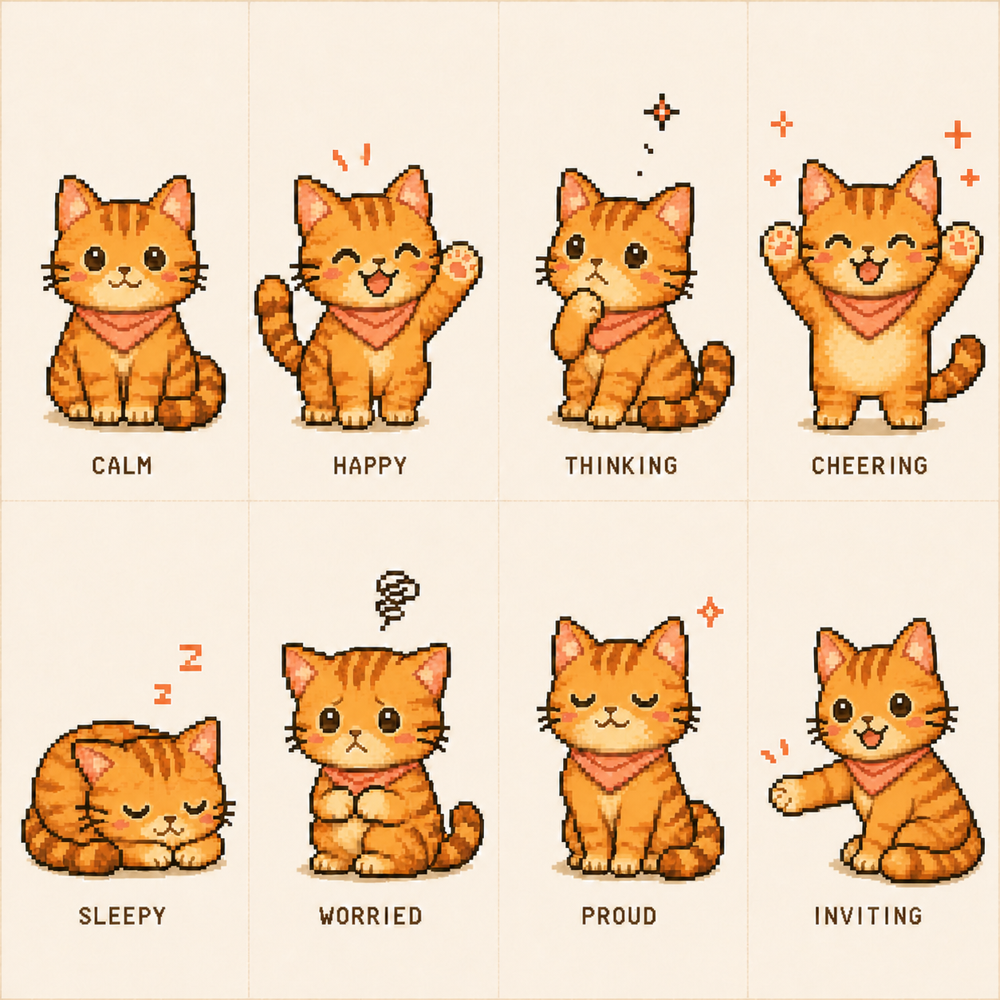
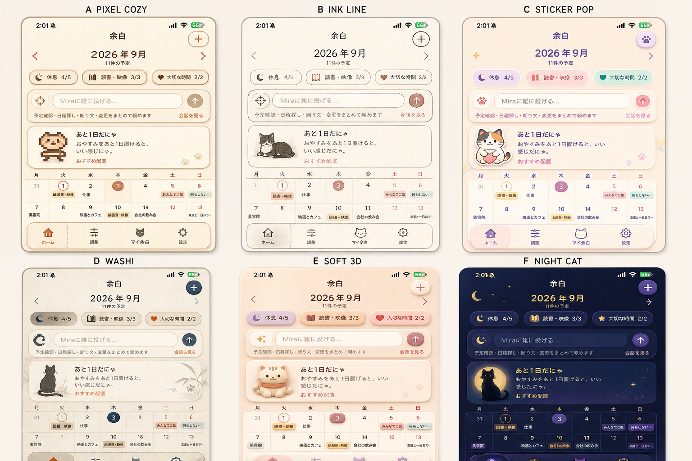

# Mira スキン・アートディレクション

## 決定事項

- Pixel Cat スキンは、茶トラ猫を正式なキャラクター方向とする。
- 猫は全身を橙〜アプリコット系のベース毛色で統一する。
- クリーム色は口元、顎、胸元、足先の小さな範囲に限定し、顔だけが白く抜けて見える配色を避ける。
- 額、頬、背中、脚、しっぽには濃いオレンジ〜シナモン色の縞を入れる。
- コーラル色のネッカチーフをMira固有のアクセントとして使う。
- UIへ組み込む際は、拡大縮小でぼかさず、ピクセル境界を保つ。

## Pixel Cat：茶トラ感情コンセプト

現時点の8種類は、キャラクター表現とアプリ内状態を検討するためのコンセプトである。

| 表現 | 主な用途 | 現行 `CatMood` との対応案 |
|---|---|---|
| CALM | 通常案内、待機 | `idle` |
| HAPPY | 歓迎、軽い成功 | `happy` |
| THINKING | 解析中、日程検討中 | `thinking` |
| CHEERING | 配置成功、完了演出 | `celebrating` |
| SLEEPY | 休息提案、就寝余白 | `sleeping` |
| WORRIED | 予定過多、競合警告 | `warning` / `tired` |
| PROUD | 余白確保、目標達成 | `relaxed` |
| INVITING | 会話開始、予定追加の誘導 | `inviting` |

### 本番素材化

8種類を透過PNGの個別素材として `Assets.xcassets` に収録済み。各素材は128pxの1xを基準に、ピクセル境界を維持した2x・3xを用意する。`PixelCatView` は `CatMood` から対応素材を選び、素材が欠けた場合のみ従来のプログラム描画へフォールバックする。

品質条件は以下とする。

- 8体で輪郭、顔の比率、縞の位置、配色、ネッカチーフを統一する。
- 小さな案内カードでも感情が判別できるシルエットにする。
- 透過背景と四隅のアルファを維持する。
- Light / Darkの両方で輪郭が沈まないよう確認する。
- VoiceOverでは絵の見た目ではなく、状態の意味を読み上げる。
- Reduce Motion時も静止画だけで状態を理解できるようにする。

## 保留：Washi Cat スキン

6方向の比較では、DのWASHI案をPixel Catとは別の独立スキンとして採用候補に残す。

Washi Catは後続フェーズで制作する。Pixel Catの単なる色違いにはせず、以下を一体で設計する。

- 墨絵調の猫シルエット
- 和紙の表面感
- 墨、藍、柿色を中心としたパレット
- カード境界、予定タグ、チップ、背景の静かな和風表現
- 情報量や画面構造は他スキンと共通にし、操作位置を変えない

## 実装方針

- スキンはキャラクター画像だけでなく、`MiraThemePalette`と連動させる。
- 構造的な操作アイコンはSF Symbolsを維持し、猫や和風装飾で置き換えない。
- `PixelCatView`は本番画像が欠けた場合でも、既存のプログラム描画へ安全にフォールバックする。
- 本資料の一覧画像は方向性確認用として保持し、アプリでは個別に生成・調整した本番素材を使う。
